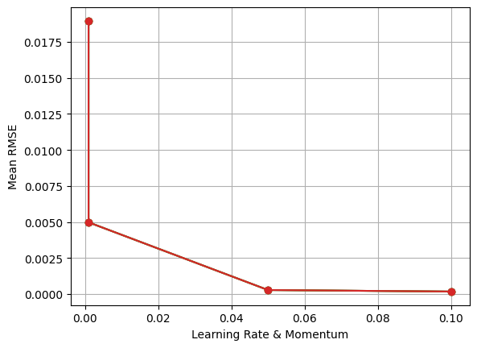
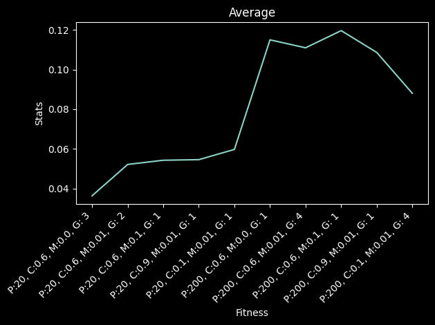

# Computational Intelligence

Archaeological research can greatly benefit from the use of new technologies, particularly when dealing with ancient inscriptions that often face challenges such as partial or complete destruction, illegible writing, or loss of symbols and letters, making dating and classification difficult. In this project, you are provided with a dataset excerpt from the largest available collection of ancient Greek inscriptions, I.PHI, which originates from the processing of the PHI (Packard Humanities Institute) database. The excerpt includes 2,802 inscriptions, all of which have a date range from 720 BCE to 1453 CE, and a vocabulary of 24,679 unique words.  

## Part A
#### Stack
Python, Keras, scikit-learn
 
Part A's concept was to develop and train an Artificial Neural Network (ANN) to predict the precise date of an inscription based on its text, with the option to use additional features such as the geographical location of the inscription.
  

## Part B
#### Stack
Python, DEAP, scikit-learn
  
Part B's concept was to implement a Genetic Algorithm (GA) to 'guess' the missing words and restore the given inscription. The main idea behind using a GA is to search for the missing words so that the completed inscription resembles similar inscriptions as closely as possible.
